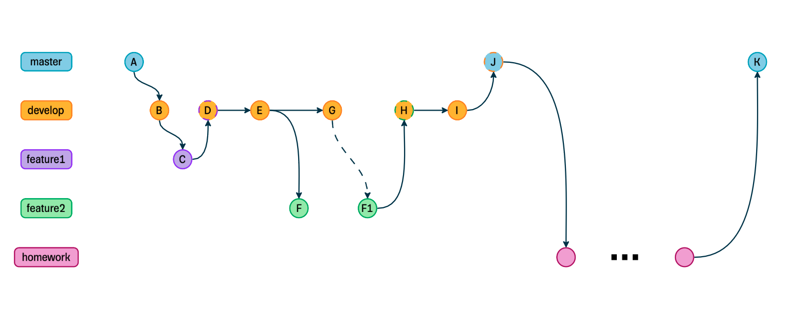

# Старт проекта: git, оформление пулл-реквестов, системы сборки и линтеры

Выполните три задания ниже в указанной последовательности.

## Задание 1: Git

Выполните действия из таблицы ниже. Картинка является просто визуализацией коммитов для более легкого выполнения задания.

- Желательно для выполнения задания пользоваться только консолью, не прибегая к помощи ui инструментов.
- Не удаляйте ветки после выполнения задания.
- Не используйте fast-forward.



<table>
  <tr>
    <th>Действия</th>
    <th>Название коммита</th>
    <th>Ветка</th>
    <th>Тип</th>
    <th>Контент в index.js</th>
  </tr>
  <tr>
    <td>Создайте index.js</td>
    <td>A: add index.js</td>
    <td>master</td>
    <td>commit</td>
    <td></td>
  </tr>
  <tr>
    <td>Создайте ветку develop, добавьте комментарий в index.js</td>
    <td>B: add comment</td>
    <td>develop</td>
    <td>commit</td>
    <td><pre><code>
// Bug count 0
    </code></pre></td>
  </tr>
  <tr>
    <td>Создайте ветку feature1, добавьте константу <code>a</code> в index.js<br/> и комментарий</td>
    <td>C: add variable a and comment</td>
    <td>feature1</td>
    <td>commit</td>
    <td><pre><code>
// Bug count 1
const a = 1;
    </code></pre></td>
  </tr>
  <tr>
    <td>Смержите ветку feature1 в ветку develop</td>
    <td>D: merge branch ‘feature1’ into ‘develop’</td>
    <td>develop</td>
    <td>merge commit</td>
    <td><pre><code>
// Bug count 1
const a = 1;
    </code></pre></td>
  </tr>
  <tr>
    <td>Добавьте <code>console.log</code> в index.js</td>
    <td>E: add console.log</td>
    <td>develop</td>
    <td>commit</td>
    <td><pre><code>
// Bug count 1
const a = 1;
console.log(a);
    </code></pre></td>
  </tr>
  <tr>
    <td>Создайте ветку feature2, измените переменную <code>a</code> в index.js<br/> и комментарий</td>
    <td>F: change variable a</td>
    <td>feature2</td>
    <td>commit</td>
    <td><pre><code>
// Bug count 2
const a = 2;
console.log(a);
    </code></pre></td>
  </tr>
  <tr>
    <td>Измените комментарий</td>
    <td>G: fix bug</td>
    <td>develop</td>
    <td>commit</td>
    <td><pre><code>
// Bug count 0
const a = 1;
console.log(a);
    </code></pre></td>
  </tr>
  <tr>
    <td>Проведите ребейз коммита F на коммит G,<br/> решите конфликты слияния (чтобы счетчик багов стал равен 1)</td>
    <td>F1: rebase ‘feature2’</td>
    <td>feature2</td>
    <td>rebase commit</td>
    <td><pre><code>
// Bug count 1
const a = 2;
console.log(a);
    </code></pre></td>
  </tr>
  <tr>
    <td>Смержите ветку feature2 в ветку develop</td>
    <td>H: merge branch ‘feature2’ into ‘develop’</td>
    <td>develop</td>
    <td>merge commit</td>
    <td><pre><code>
// Bug count 1
const a = 2;
console.log(a);
    </code></pre></td>
  </tr>
  <tr>
    <td>Измените комментарий</td>
    <td>I: fix bug</td>
    <td>develop</td>
    <td>commit</td>
    <td><pre><code>
// Bug count 0
const a = 2;
console.log(a);
   </code></pre></td>
  </tr>
  <tr>
    <td>Смержите ветку develop в ветку master</td>
    <td>J: merge branch ‘develop’ into ‘master’</td>
    <td>master</td>
    <td>merge commit</td>
    <td><pre><code>
// Bug count 0
const a = 2;
console.log(a);
    </code></pre></td>
  </tr>
  <tr>
    <td>Создайте ветку homework, выполните задания ниже:<br/> на это у вас любое количество коммитов,<br/> главное делать их в ветке homework,<br/> называть коммиты необходимо как HW1, HW2 и т.д.,<br/> сообщения коммитов должны быть осмысленными,<br/> чтобы было понятно, что было изменено</td>
    <td>HW1</td>
    <td>homework</td>
    <td>commit</td>
    <td><pre><code>
// Bug count 0
const a = 2;
console.log(a);
    </code></pre></td>
  </tr>
  <tr>
    <td>Смержите ветку homework в ветку master</td>
    <td>K: Merge branch ‘homework’ into ‘master’</td>
    <td>master</td>
    <td>merge commit</td>
    <td><pre><code>
// Bug count 0
const a = 2;
console.log(a);
    </code></pre></td>
  </tr>
</table>

В итоге при вводе команды `git log --oneline --graph` график коммитов от `A` до `J` должен выглядеть следующим образом:

```
*   c18f926 J: Merge branch ‘develop’ into ‘master’
|\  
| * d125804 (develop) I: fix bug
| *   b7efda6 H: Merge branch ‘feature2’ into ‘develop’
| |\  
| | * 62ddc47 (feature2) F1: rebase ‘feature2’
| |/  
| * cb5c8b3 G: fix bug
| * 71ba308 E: add console.log
| *   8d162e8 D: Merge branch ‘feature1’ into ‘develop’
| |\  
| | * 4f178ac (feature1) C: add variable a and comment
| |/  
| * 01d501d B: add comment
|/  
* 6d550a8 A: add index.js
```

## Задание 2: Линтеры

> Чтобы линтеры подсвечивали ошибки, необходимо настроить ваши редакторы кода

В папке `src/lint` находятся файлы с кодом, для которых необходимо настроить eslint и stylelint конфиги. Создайте `eslint.config.js`, `stylelint.config.js` и `prettier.config.js` в корне проекта и выполните следующие задания:

### Eslint

Настроить eslint так, чтобы он подсвечивал в `scr/lint/lint.js` следующие исключения как ошибки:

- Неиспользуемые переменные
- Когда не используется сокращенный синтаксис для определения объектов
- Когда не используются фигурные скобки у if
- Переопределение переменных
- Двойные кавычки у строк
- Отсутствие пробелов после ключевых слов языка
- Использование == вместо ===
- Недостижимый код

### Stylelint

Настроить Stylelint так, чтобы он подсвечивал в `scr/lint/lint.css` следующие исключения как ошибки:

- Использование имен цветов (`black`, `white` и прочее)
- Пустые строки внутри селекторов
- Одинаковые селекторы
- Появление селекторов со специфичностью ниже после объявление селекторов с более высокой специфичностью
- Отсутствие пустой строки между объявлениями селекторов

### Prettier

Настроить Prettier так, чтобы он поддерживал следующие опции:

- Исправлял двойные кавычки на одинарные
- Размер табуляции: 4
- Ставил пробелы между фигурными скобками в объектах

## Задание 3: Сборщики

### Настроить сборку через **Webpack**

1. Установить `Webpack`, `webpack-cli` и `webpack-dev-server`
2. Настроить `webpack.config.сjs`:
    - Указать output директорию как `dist_webpack`
3. Добавить в package.json скрипты `“start:webpack”: “webpack serve”` и  `“build:webpack”: “webpack”`

В результате в папке `dist_webpack` должен появится index.js файл с собранным js кодом.

### Настроить сборку через Vite

1. Установить `vite`
2. Настроить `vite.config.js`:
    - Указать output директорию как `dist_vite`
3. Добавить в package.json скрипты `“start:vite”: “vite”` и  `“build:vite”: “vite build”`

В результате в папке `dist_vite` должен появится собранный проект, а в папке `dist_vite/assets` должен появится js файл с собранным кодом.